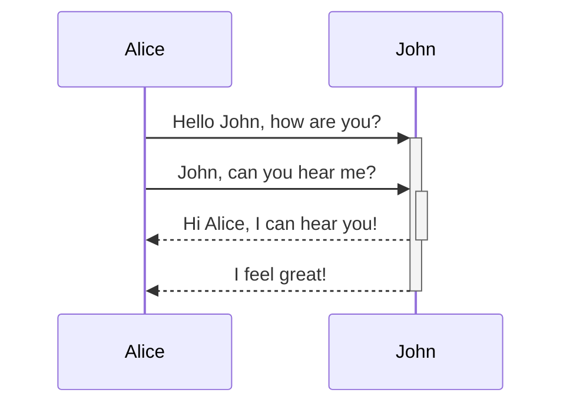
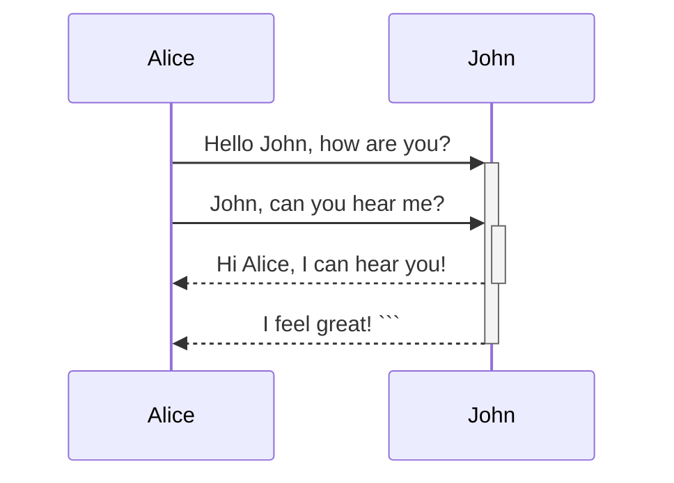

---
## Цитирование

>Это блок цитирования. Обычно он отображается с отступом и имеет другой цвет фона.
> \- Автор

Или при помощи выноски [[#^38eadc|выноски с цитатой]].

---
## Форматирование текста

| Стиль                     | Синтаксис             | Пример                                   | Выход                                 |
| ------------------------- | --------------------- | ---------------------------------------- | ------------------------------------- |
| Смелый                    | `** **`или`__ __`     | `**Bold text**`                          | **Жирный текст**                      |
| Курсив                    | `* *`или`_ _`         | `*Italic text*`                          | _Курсивный текст_                     |
| Зачеркивание              | `~~ ~~`               | `~~Striked out text~~`                   | ~~Зачеркнутый текст~~                 |
| Выделять                  | `== ==`               | `==Highlighted text==`                   | ==Выделенный текст==                  |
| Жирный и вложенный курсив | `** **`и`_ _`         | `**Bold text and _nested italic_ text**` | **Жирный текст и _вложенный_ курсив** |
| Жирный и курсив           | `*** ***`или`___ ___` | `***Bold and italic text***`             | **_Текст жирный и курсив_**           |
| Подчеркнутый (HTML)       | `<u> <\u>`            | `<u> Почеркнутый </u>`                   | <u> Почеркнутый </u>                  | 

---
## Фрагменты кода

- простой пример

`cube = [i ** 3 for i in range(100)]`
 ^527d92
- С подсветкой синтаксиса

```python
def encoder(message, code, format):
    mass_numeric = []
    encoder_massage = ''
    for char in message:
        mass_numeric.append(chars[char])
    for i in range(len(mass_numeric)):
        if(format):
            mass_numeric[i] = mass_numeric[i] + int(code[i % 4])
        else:
            mass_numeric[i] = mass_numeric[i] - int(code[i % 4])
    
    for number in mass_numeric:
        encoder_massage = encoder_massage + str(chars_decod[number])
    
    return encoder_massage
```

---
## Вставка файлов


---
## Списки

### Нумерованный

1. Одни
2. Два
	1. ...
	2. ...
	3. ...
		1. ...
			
3.  Три
4. Четыре

### Маркированный
- 1
- 2
- 3
	- 4
	- **5**

---
## Ссылки

1. [Ссылка на web страницу](https://www.google.com)
2. Ссылка на заголовок в заметке [[#Фрагменты кода]]
2. Ссылка на заголовок в заметке ![[#Фрагменты кода]]
3. Ссылка на другую заметку [[Заметка для примера]]
3. Ссылка на другую заметку ![[Заметка для примера]]
4. Ссылка на предложение ![[#^527d92]]
---
## Таблицы

| Left-Aligned  | Center Aligned  | Right Aligned |
|:------------- |:---------------:| -------------:|
| col 3 is      | some wordy text |     **$1600** |
| col 2 is      | centered        |         $12   |
| zebra stripes | are neat        |        ~~1$~~ |

|Колонка 1|Колонка 2|Колонка 3|
|:---|---:|:---:|
|1|2|3|
|4|5|6|
|7|8|9|
|Выравнивание | по | колонкам|

| Тест                             | Тест2       | Тест3            |
| -------------------------------- | ----------- | ---------------- |
| Еще что-то                       | Вооооооооот | Ну и еще немного |
| И в итоге у нас кайфовая таблица | ))))        | ++++             |

---
## Формулы

$$\sum_{i=1}^{n} \frac{1^2 + \pi}{e_i} + \lim_{x -> 0}(e^{(2+i)x}+sin(2i-x)) $$

---

## Выноски

### Складные выноски
Выноску можно сделать складной, добавив плюс (+) или минус (-) непосредственно после идентификатора типа.

Знак плюс по умолчанию расширяет выноску, а знак минус вместо этого сворачивает ее.

> [!faq]- Are callouts foldable?
> Yes! In a foldable callout, the contents are hidden when the callout is collapsed.

> [!faq]+ Are callouts foldable?
> Yes! In a foldable callout, the contents are hidden when the callout is collapsed.
### Типы выносок

> [!quote]-
> Lorem ipsum dolor sit amet
Псевдоним: `cite`

^38eadc

> [!example]-
> Lorem ipsum dolor sit amet

> [!bug]-
> Lorem ipsum dolor sit amet

>[!danger]-
> Lorem ipsum dolor sit amet
Псевдоним: `error`

> [!failure]-
> Lorem ipsum dolor sit amet
> Псевдонимы: `fail`, `missing`

> [!warning]-
> Lorem ipsum dolor sit amet
> Псевдонимы: `caution`, `attention`

> [!question]-
> Lorem ipsum dolor sit amet
> Псевдонимы: `help` ,`faq`

> [!success]-
> Lorem ipsum dolor sit amet
> Псевдонимы: `check`, `done`

> [!tip]-
> Lorem ipsum dolor sit amet
> Псевдонимы: `hint`, `important`

> [!todo]-
> Lorem ipsum dolor sit amet

> [!info]-
> Lorem ipsum dolor sit amet

> [!abstract]-
> Lorem ipsum dolor sit amet

> [!note]-
> Lorem ipsum dolor sit amet
## Сноски

Это простая сноска[^1][^2][^note].

[^1]: это текст, на который есть ссылка.
[^2]: добавьте 2 пробела в начале каждой новой строки.
    Это позволяет писать сноски, занимающие несколько строк.
[^note]: Именованные сноски по-прежнему отображаются в виде цифр, но их можно упростить для идентификации и связывания ссылок.

```markdown
Это простая сноска[^1][^2][^note].

[^1]: это текст, на который есть ссылка.
[^2]: добавьте 2 пробела в начале каждой новой строки.
    Это позволяет писать сноски, занимающие несколько строк.
[^note]: Именованные сноски по-прежнему отображаются в виде цифр, но их можно упростить для идентификации и связывания ссылок.
```

## Диаграмма

>[!tip]- Графический редактор
>https://mermaid-js.github.io/mermaid-live-editor

Вы можете добавлять диаграммы и диаграммы в свои заметки, используя [Mermaid](https://mermaid-js.github.io/) . Mermaid поддерживает ряд диаграмм, таких как [блок-схемы](https://mermaid.js.org/syntax/flowchart.html) , [диаграммы последовательности](https://mermaid.js.org/syntax/sequenceDiagram.html) и [временные шкалы](https://mermaid.js.org/syntax/timeline.html) .





```markdown
